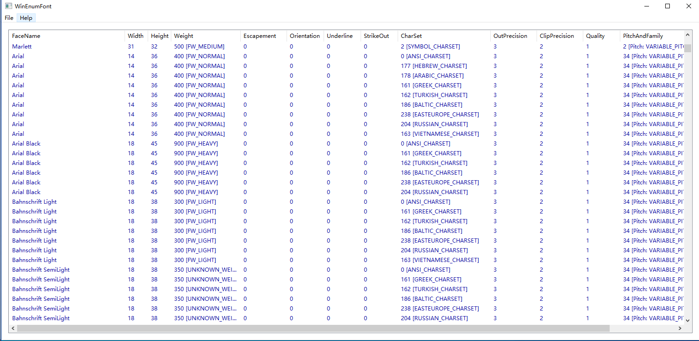

# WinEnumFont
a win32 c++ tiny windows application,enum all system font info

### Features:
- Pure C++ Win32 application
- Enum All Font In ListView
- Calc The Pitch And FontFamily

### W.I.P
- Show Demo
- Add Or Delete Font

### Snap 
